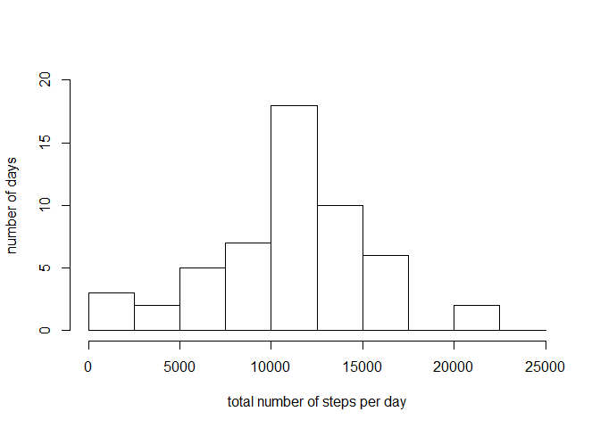
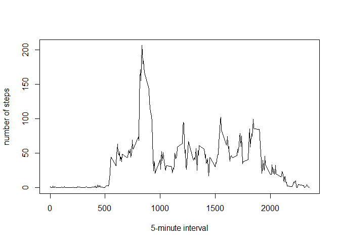
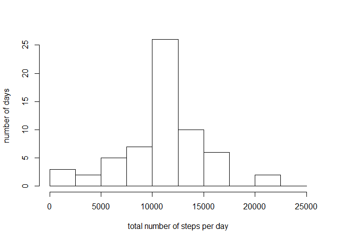

# Reproducible Research: Peer Assessment 1


```r
library(dplyr)
```

```
## Warning: package 'dplyr' was built under R version 3.2.2
```

```
## 
## Attaching package: 'dplyr'
## 
## The following objects are masked from 'package:stats':
## 
##     filter, lag
## 
## The following objects are masked from 'package:base':
## 
##     intersect, setdiff, setequal, union
```

```r
library(lattice)
options(scipen = 5, digits = 2) ## set the numeric output options
```

## Loading and preprocessing the data
### 1. load the data

```r
activity <- read.csv("activity.csv")
str(activity)  ## take a look at the overall structure of the dataset
```

```
## 'data.frame':	17568 obs. of  3 variables:
##  $ steps   : int  NA NA NA NA NA NA NA NA NA NA ...
##  $ date    : Factor w/ 61 levels "2012-10-01","2012-10-02",..: 1 1 1 1 1 1 1 1 1 1 ...
##  $ interval: int  0 5 10 15 20 25 30 35 40 45 ...
```
Note that $date is a factor.

### 2. preprocess/transform the data (if necessary)

```r
activity$Date <- as.Date(activity$date, "%Y-%m-%d")  ## add a column with class of Date
str(activity)  ## check the structure as a comparison with the original dataset
```

```
## 'data.frame':	17568 obs. of  4 variables:
##  $ steps   : int  NA NA NA NA NA NA NA NA NA NA ...
##  $ date    : Factor w/ 61 levels "2012-10-01","2012-10-02",..: 1 1 1 1 1 1 1 1 1 1 ...
##  $ interval: int  0 5 10 15 20 25 30 35 40 45 ...
##  $ Date    : Date, format: "2012-10-01" "2012-10-01" ...
```
Note that $date is a factor while $Date has a class of Date.

## What is mean total number of steps taken per day?
### 1. calculate the total number of steps taken per day
Use dplyr package to process the data set.

```r
activity.dt <- tbl_df(activity)  ## wrap the dataset into tbl_df object
sum <- activity.dt %>%
  group_by(date)   %>%
  summarize(sum = sum(steps))
sum  ## print sum to see its structure and the first 10 rows
```

```
## Source: local data frame [61 x 2]
## 
##          date   sum
##        (fctr) (int)
## 1  2012-10-01    NA
## 2  2012-10-02   126
## 3  2012-10-03 11352
## 4  2012-10-04 12116
## 5  2012-10-05 13294
## 6  2012-10-06 15420
## 7  2012-10-07 11015
## 8  2012-10-08    NA
## 9  2012-10-09 12811
## 10 2012-10-10  9900
## ..        ...   ...
```

### 2. make a histogram of the total number of steps taken each day
Use the base plotting system.

```r
hist(as.data.frame(sum)$sum, ylim = c(0,20), 
     breaks = c(0, 2500, 5000, 7500, 10000, 12500, 15000, 17500, 20000, 22500, 25000),
     xlab = "total number of steps per day", ylab = "number of days", main = NULL)
```

 

### 3. calculate and report the mean and median of the total number of steps taken per day

```r
mean <- mean(sum$sum, na.rm = TRUE)
median <- median(sum$sum, na.rm = TRUE)
```
Ignoring the NAs  
Mean: 10766.19; Median: 10765  

## What is the average daily activity pattern?
### 1. make a time series plot
Use the base plotting system to generate the plot with the 5-minute interval as x-axis and the average number of steps taken average acrossed all days as y-axis

```r
pattern <- activity.dt %>%
  group_by(interval)   %>%
  summarize(mean = mean(steps, na.rm = TRUE))
pattern  ## print pattern to see its structure and the first 10 rows
```

```
## Source: local data frame [288 x 2]
## 
##    interval  mean
##       (int) (dbl)
## 1         0 1.717
## 2         5 0.340
## 3        10 0.132
## 4        15 0.151
## 5        20 0.075
## 6        25 2.094
## 7        30 0.528
## 8        35 0.868
## 9        40 0.000
## 10       45 1.472
## ..      ...   ...
```

```r
pattern <- as.data.frame(pattern)  ## transform the tbl_df object back to data frame for plotting
plot(pattern$interval, pattern$mean, type = "l", xlab = "5-minute interval", ylab = "number of steps")
```

 

### 2. Which 5-minute interval, on average across all the days in the dataset, contains the maximum number of steps?

```r
interval_moststeps <- pattern$interval[which(pattern$mean==max(pattern$mean))]
```
The interval 835 contains the maximum number of steps on average across all the days.

## Imputing missing values
### 1. calculate and report the total number of missing values in the dataset

```r
number_NA <- sum(!complete.cases(activity))
number_NA 
```

```
## [1] 2304
```

```r
## make sure that all the NAs are in the steps column
sum(is.na(activity$steps))
```

```
## [1] 2304
```

```r
sum(is.na(activity$date))
```

```
## [1] 0
```

```r
sum(is.na(activity$interval))
```

```
## [1] 0
```
Total number of missing values: 2304

### 2. devise a strategy for filling in all of the missing values in the dataset. 
For this analysis, use the mean for the particular 5-minute interval averaged across all the days since it has already been calculated.

```r
head(pattern)  ## review the structure of pattern 
```

```
##   interval  mean
## 1        0 1.717
## 2        5 0.340
## 3       10 0.132
## 4       15 0.151
## 5       20 0.075
## 6       25 2.094
```

### 3. create a new dataset that is equal to the original dataset but with the missing data filled in.

```r
new_activity <- activity
for (i in 1:nrow(new_activity)) {
  if (is.na(new_activity$steps[i])) {
    new_activity$steps[i] <- pattern$mean[which(pattern$interval == new_activity$interval[i])]
  }
}
sum(!complete.cases(new_activity))  ## check that all NAs have been replaced
```

```
## [1] 0
```

### 4. make a histogram of the total number of steps taken each day 

```r
new_activity.dt <- tbl_df(new_activity)
new_sum <- new_activity.dt %>%
  group_by(date)           %>%
  summarize(sum = sum(steps))
hist(as.data.frame(new_sum)$sum, ylim = c(0,25), 
     breaks = c(0, 2500, 5000, 7500, 10000, 12500, 15000, 17500, 20000, 22500, 25000),
     xlab = "total number of steps per day", ylab = "number of days", main = NULL)
```

 

###   ... calculate and report the mean and median total number of steps taken per day. 

```r
new_mean <- mean(new_sum$sum)
new_median <- median(new_sum$sum)
```
After imputing NAs  
Mean: 10766.19; Median: 10766.19  

###   ... Do these values differ from the estimates from the first part of the assignment? What is the impact of imputing missing data on the estimates of the total daily number of steps?
While the new mean and median of the total number of steps/day are quite close to those prior to imputing NAs, the distribution of total number of steps/day after imputing NAs is more concentrated around the mean/median from the comparsion between the two histograms.   

## Are there differences in activity patterns between weekdays and weekends?
### 1. create a new factor variable in the dataset with two levels - "weekday" and "weekend" 

```r
new_activity$weekday <- weekdays(new_activity$Date)  ## add a column to indicate the day in the week
## for loop to indicate the two levels of "weekday" or "weekend"
for (i in 1:nrow(new_activity)) {
  if (new_activity$weekday[i] == "Saturday" || new_activity$weekday[i] == "Sunday") {
    new_activity$daytype[i] <- "weekend"
  }
  else {
    new_activity$daytype[i] <- "weekday"
  }
}
new_activity$daytype <- as.factor(new_activity$daytype)  ## coerce into factor 
str(new_activity)  ## check the structure of the dataset
```

```
## 'data.frame':	17568 obs. of  6 variables:
##  $ steps   : num  1.717 0.3396 0.1321 0.1509 0.0755 ...
##  $ date    : Factor w/ 61 levels "2012-10-01","2012-10-02",..: 1 1 1 1 1 1 1 1 1 1 ...
##  $ interval: int  0 5 10 15 20 25 30 35 40 45 ...
##  $ Date    : Date, format: "2012-10-01" "2012-10-01" ...
##  $ weekday : chr  "Monday" "Monday" "Monday" "Monday" ...
##  $ daytype : Factor w/ 2 levels "weekday","weekend": 1 1 1 1 1 1 1 1 1 1 ...
```

### 2. make a panel plot containing a time series plot 
Use the lattice plotting system to generate the plot With the 5-minute interval as x-axis and the average number of steps taken, averaged across all weekday days or weekend days as y-axis.

```r
new_activity.dt <- tbl_df(new_activity)
new_pattern <- new_activity.dt %>%
  group_by(daytype, interval) %>%
  summarize(mean = mean(steps))
new_pattern <- as.data.frame(new_pattern)
xyplot(mean ~ interval | daytype, new_pattern, type = "l", layout = c(1, 2), xlab = "Interval", ylab = "Number of steps")
```

 
